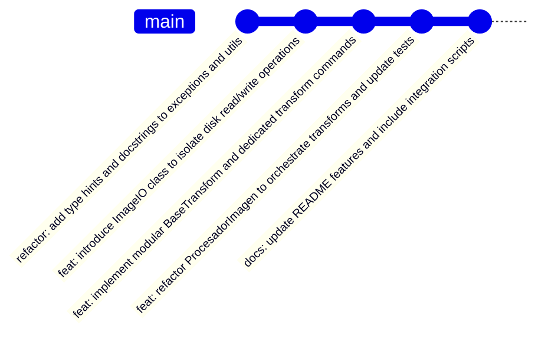

# Resumen del Trabajo Realizado (Git Commit Walkthrough)

Se organizo exitosamente tus **21 archivos modificados/creados** en **5 commits independientes y lógicos**. En cada etapa se verificó de manera aislada e incremental que el código compilase y que toda la suite de pruebas unitarias (16 pruebas) pasara perfectamente.

El árbol de cambios en Git quedó estructurado de la siguiente manera:



---

## Detalle de los Commits Realizados

### 1. Refactorización de excepciones y utilidades
* **Mensaje:** `refactor: add type hints and docstrings to exceptions and utils`
* **Archivos:**
  * [`.gitignore`](file:///c:/Users/jazmin/Documents/Proyectos/2026-imagenes-IFTS/TP-final-bonini/.gitignore)
  * [`src/optilens/exceptions.py`](file:///c:/Users/jazmin/Documents/Proyectos/2026-imagenes-IFTS/TP-final-bonini/src/optilens/exceptions.py)
  * [`src/optilens/utils.py`](file:///c:/Users/jazmin/Documents/Proyectos/2026-imagenes-IFTS/TP-final-bonini/src/optilens/utils.py)
* **Objetivo:** Establece una base de desarrollo robusta con tipado estático completo y documentación de soporte limpia.

### 2. Aislamiento de lectura/escritura física
* **Mensaje:** `feat: introduce ImageIO class to isolate disk read/write operations`
* **Archivos:**
  * [`src/optilens/io.py`](file:///c:/Users/jazmin/Documents/Proyectos/2026-imagenes-IFTS/TP-final-bonini/src/optilens/io.py)
  * [`tests/test_io.py`](file:///c:/Users/jazmin/Documents/Proyectos/2026-imagenes-IFTS/TP-final-bonini/tests/test_io.py)
* **Objetivo:** Encapsula las operaciones de entrada/salida a disco con soporte seguro de liberación de descriptores de archivos (`img.load()`) y conversiones de seguridad RGBA a RGB para JPEG.

### 3. Patrón Command para transformaciones independientes
* **Mensaje:** `feat: implement modular BaseTransform and dedicated transform commands`
* **Archivos:**
  * [`src/optilens/transforms/__init__.py`](file:///c:/Users/jazmin/Documents/Proyectos/2026-imagenes-IFTS/TP-final-bonini/src/optilens/transforms/__init__.py)
  * [`src/optilens/transforms/base.py`](file:///c:/Users/jazmin/Documents/Proyectos/2026-imagenes-IFTS/TP-final-bonini/src/optilens/transforms/base.py)
  * `src/optilens/transforms/*.py` (brightness, contrast, resize, saturation, threshold, watermark)
  * [`tests/test_transforms.py`](file:///c:/Users/jazmin/Documents/Proyectos/2026-imagenes-IFTS/TP-final-bonini/tests/test_transforms.py)
* **Objetivo:** Desacopla las transformaciones de imágenes en comandos modulares independientes y reutilizables, cumpliendo con el principio de responsabilidad única.

### 4. Orquestación del Pipeline en la Fachada
* **Mensaje:** `feat: refactor ProcesadorImagen to orchestrate transforms and update tests`
* **Archivos:**
  * [`src/optilens/core.py`](file:///c:/Users/jazmin/Documents/Proyectos/2026-imagenes-IFTS/TP-final-bonini/src/optilens/core.py)
  * [`src/optilens/__init__.py`](file:///c:/Users/jazmin/Documents/Proyectos/2026-imagenes-IFTS/TP-final-bonini/src/optilens/__init__.py)
  * [`tests/__init__.py`](file:///c:/Users/jazmin/Documents/Proyectos/2026-imagenes-IFTS/TP-final-bonini/tests/__init__.py)
  * [`tests/test_core.py`](file:///c:/Users/jazmin/Documents/Proyectos/2026-imagenes-IFTS/TP-final-bonini/tests/test_core.py)
* **Objetivo:** Integra los comandos de transformación y la clase `ImageIO` dentro del orquestador `ProcesadorImagen`. Se mantiene la interfaz fluida (Fluent API) por compatibilidad y se agrega soporte para transformaciones personalizadas externas (Principio Open/Closed).

### 5. Documentación y Scripts Demostrativos
* **Mensaje:** `docs: update README features and include integration scripts`
* **Archivos:**
  * [`README.md`](file:///c:/Users/jazmin/Documents/Proyectos/2026-imagenes-IFTS/TP-final-bonini/README.md)
  * [`examples/ejemplo.py`](file:///c:/Users/jazmin/Documents/Proyectos/2026-imagenes-IFTS/TP-final-bonini/examples/ejemplo.py)
  * [`examples/test_all_features.py`](file:///c:/Users/jazmin/Documents/Proyectos/2026-imagenes-IFTS/TP-final-bonini/examples/test_all_features.py)
* **Objetivo:** Documenta las nuevas técnicas y proporciona ejemplos prácticos para facilitar el consumo de la librería por parte de otros desarrolladores.

---

## Verificación de Integridad

Todas las pruebas unitarias pasaron exitosamente. La salida del comando de prueba final es la siguiente:

```bash
uv run python -m unittest discover -s tests
................
----------------------------------------------------------------------
Ran 16 tests in 0.078s

OK
```

El estado actual del directorio de trabajo está completamente limpio y listo para ser subido a tu servidor remoto:

```bash
On branch main
Your branch is ahead of 'origin/main' by 5 commits.
  (use "git push" to publish your local commits)

nothing to commit, working tree clean
```
